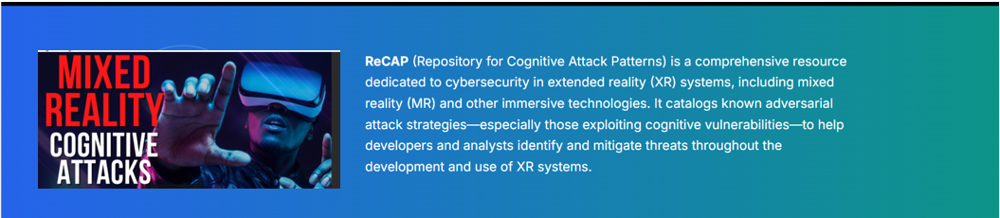

# ReCAP - Repository of Cognitive Attack Patterns

## Introduction
Whether designing massive enterprise IT infrastructure or embedded cyber-physical systems, the cybersecurity assessment is a critical activity that often occurs multiple times during product development. Assessments typically involve iterating over a list of known vulnerabilities or attacks and determining if they are applicable to the current system. Effective protection against cyber-attacks in mixed-reality (MR) systems requires an understanding of how an adversary may exploit a cognitive vulnerability. As part of the Modeling and Analysis Toolkit for Realizable Intrinsic Cognitive Security (MATRICS) effort on the DARPA Intrinsic Cognitive Security (ICS) program, Collins is building a public-facing Repository of Cognitive Attack Patterns (ReCAP) that enumerate cognitive attacks and corresponding mitigations to facilitate the elicitation of cognitive guarantees.  

ReCAP is a public-facing resource designed to enumerate cognitive attack patterns along with corresponding mitigations, enabling the development of cognitive assurance strategies. It provides structured and relevant information to support comprehensive analysis of cognitive attacks in extended reality (XR) environments. By mapping the relationships among attacks, vulnerabilities, defenses, and assurance arguments, ReCAP serves as a foundational tool for advancing research and practice in cognitive security within immersive systems.

Validation efforts for both the attack classification schema and the user interface are currently underway. This includes the integration of published XR cognitive attack patterns and the incorporation of newly identified patterns emerging from ongoing research within the ICS program.

To enhance the accuracy, completeness, and practical value of ReCAP, contributions from the broader research community are strongly encouraged. Community engagement will be vital in refining the taxonomy, enriching the repository with real-world examples, and building consensus on how cognitive security should be modeled and analyzed in XR contexts.

Furthermore, ReCAP prioritizes transparency and traceability by maintaining reference metadata, including the sources of supporting evidence such as academic publications and technical documentation
